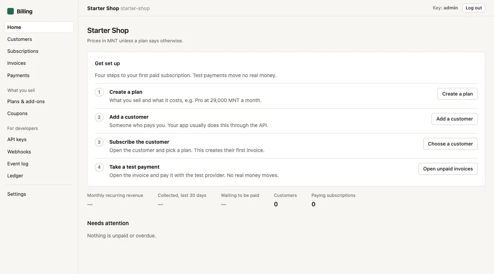
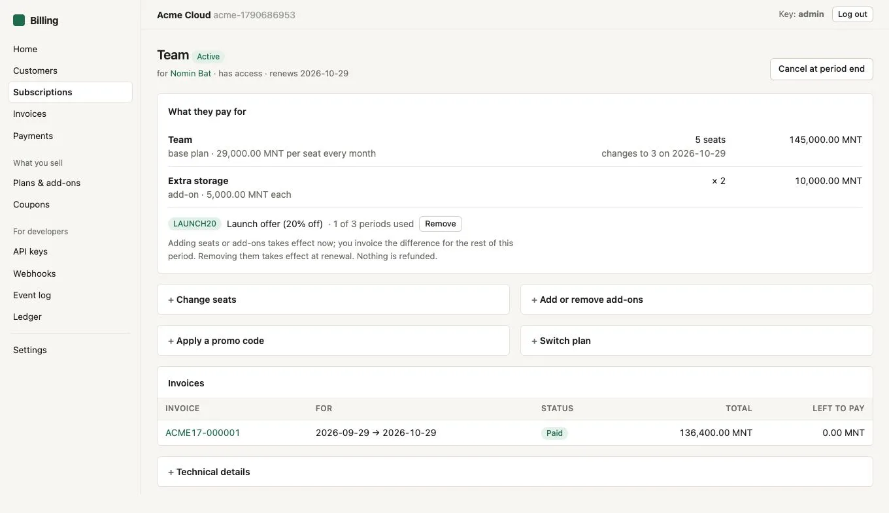
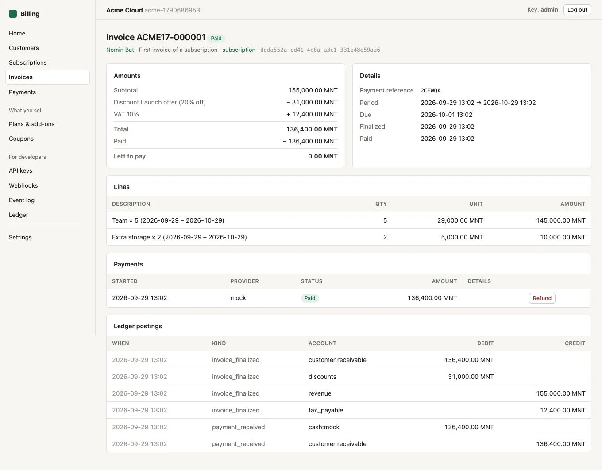

# billing

**Subscriptions, invoices, payments and a double-entry ledger, as one small Go
service any SaaS can plug into.**

Run it next to your product and talk to it over HTTP with an API key. It handles
the billing side: who is subscribed to what, what they owe, what they paid, and
whether they should have access right now. Your product keeps doing what it does.



> **Status: v0.1, early.** It has a thorough test suite, but it has not yet
> carried real money in production. Only `mock` and `manual` payment providers
> ship today; gateways are pluggable (see [writing a provider](docs/providers.md)).
> Pin a version and read the [changelog](CHANGELOG.md) before upgrading.

## What you get

- **Multi-tenant.** One deployment serves many products. Each tenant is isolated
  by its API keys; a key can never see another tenant's data.
- **Catalog.** Plans with immutable price versions, day/week/month/year billing,
  free trials, **add-ons** and **per-seat** pricing.
- **Subscriptions.**
  - Billing dates stay put: a customer who starts on the 31st renews on the last
    day of shorter months, then on the 31st again.
  - Renewal invoices go out in advance. Unpaid ones get a grace period, then the
    subscription lapses.
  - Cancel now or at period end.
  - Upgrades apply now with a prorated invoice; downgrades wait for the next
    renewal.
- **Coupons.** Promo codes for a percentage or a fixed amount off, lasting one
  period, several, or forever. They can be limited to certain plans, a number of
  uses, and a last date.
- **Tax** (optional). One configurable rate, added to prices or included in them,
  with per-customer exemptions and overrides.
- **Invoices.** Numbered and finalized, with customer credit applied
  automatically. Void and write-off. Overpayments become credit; money is never
  lost.
- **Payments.**
  - A provider interface where each tenant connects its own gateway account
    (credentials encrypted at rest).
  - Gateway intents are cancelled automatically when an invoice is paid another
    way.
  - Webhooks from gateways are verified and then double-checked with the
    gateway.
- **Ledger.** Append-only double-entry bookkeeping, idempotent postings, and a
  reconciliation report that must always balance.
- **Integration.**
  - Scoped API keys, `Idempotency-Key` on every POST, and search.
  - Signed outgoing webhooks with retries and SSRF protection.
  - A typed Go client.
- **Operator UI.** Built in and plain-language. Log in with any API key and you
  can do exactly what its scopes allow.

| Subscription | Invoice |
|---|---|
|  |  |

## Quick start

Needs Go 1.27+ and Docker.

```bash
git clone https://github.com/orshih6/billing && cd billing
cp .env.example .env
make db-up migrate run
```

Open <http://localhost:8080/ui> and log in with the `BOOTSTRAP_API_KEYS` value
from `.env`. Create a tenant, then follow the four-step checklist on its
dashboard. Or run the whole flow from a terminal:

```bash
PLATFORM_KEY=change-me-local-platform-key make smoke
```

## Integrating

Every request sends `X-API-Key`. Amounts are integers in the currency's minor
unit, so `4900000` MNT is 49,000.00.

```bash
# once: something to sell
curl -X POST localhost:8080/plans -H "X-API-Key: $KEY" -d '{"code":"pro","name":"Pro",
  "prices":[{"amount":4900000,"interval":"month"}]}'

# at checkout: your user → customer → subscription → payment
curl -X POST localhost:8080/customers -H "X-API-Key: $KEY" -d '{"external_id":"user-42","name":"Bold"}'
curl -X POST localhost:8080/subscriptions -H "X-API-Key: $KEY" \
  -d '{"customer_id":"…","plan_code":"pro","quantity":3,"promo_code":"LAUNCH20"}'
curl -X POST localhost:8080/invoices/$INVOICE/payments -H "X-API-Key: $KEY" \
  -d '{"provider":"mock","return_url":"https://app.example.com/billing/done"}'

# gate features
curl localhost:8080/customers/by-external/user-42/entitlements -H "X-API-Key: $KEY"
```

From Go:

```go
c := client.New("https://billing.example.com", os.Getenv("BILLING_API_KEY"))
cust, _ := c.EnsureCustomer(ctx, client.CustomerInput{ExternalID: "user-42", Name: "Bold"})
sub, _ := c.CreateSubscription(ctx, client.CreateSubscriptionInput{CustomerID: cust.ID, PlanCode: "pro"})
pay, _ := c.StartPayment(ctx, sub.LatestInvoice.ID, client.StartPaymentInput{Provider: "mock"})
// send the customer to pay.PayURL; then, anywhere in your app:
ents, _ := c.EntitlementsByExternalID(ctx, "user-42")
if client.HasPlan(ents, "pro") { /* unlock */ }
```

## Documentation

- [API reference and integration guide](docs/api.md)
- [Billing model](docs/billing-model.md): the rules for money, periods, proration,
  coupons and tax, and what happens in every edge case.
- [Writing a payment provider](docs/providers.md)
- [Deploying on Kubernetes](deploy/kubernetes/README.md)

## Architecture

One Go binary (`billing serve`, `billing worker`, `billing migrate`) and one
PostgreSQL database (tested on 17). There is no queue or cache.
- **Background work:** renewals, expiries, webhook deliveries and gateway cancels
  are claimed with row locks, so any number of replicas is safe.
- **UI:** server-rendered and embedded in the binary.
- **Schema:** versioned SQL migrations, also embedded.

## Contributing and security

See [CONTRIBUTING.md](CONTRIBUTING.md). Report vulnerabilities privately, as
described in [SECURITY.md](SECURITY.md).

## License

[Apache License 2.0](LICENSE)
